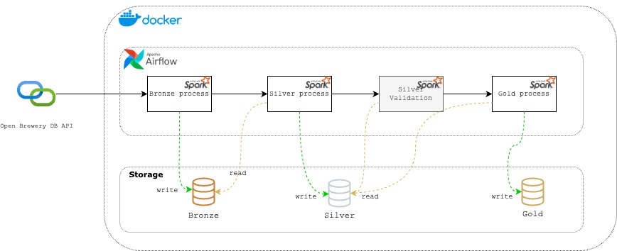

# BEES Data Engineering – Breweries Case

____
# Author
* **Patrick Martini**
* [Linkedin](https://www.linkedin.com/in/patrickmartinni/)
* trickmartini@gmail.com
____
# Objective
This data pipeline retrieves brewery data from the **Open Brewery DB API** and follows the `medallion architecture`, performing data ingestion and transformation through the Bronze, Silver and Gold layers.
The pipelin utilizes:
* `PySpark` for data processing
* `Airflow` for orchestration
* `Docker` environment configuration

The processed data is stored in `parquet` files.


# Project Structure
```
BEES_Breweries_Case/
│── dags/                    # Airflow DAGs
│   ├── spark_airflow.py     # DAG for the Breweries ETL process 
│── logs/                    # Logs generates by Airflow
│── output/                  # output files from ETL process
│── scripts/                 # Pyspark scripts for data processing
│   ├── bronze_process.py    # ETL script for bronze layer
│   ├── gold_process.py      # ETL script for gold layer
│   ├── silver_process.py    # ETL script for silver layer
│   │── validations/         # Directory for validation scripts
│── Dockerfile               # Custom Airflow image with PySpark
│── docker-compose.yaml      # Docker compose configuration
│── readme.md                # Project documentation
│── requirements.txt         # Python dependencies

```
# Requirements
Before running the pipeline, make sure Docker is installed. If not, follow oficial installment instructions bellow:
* [Install Docker](https://docs.docker.com/get-started/get-docker/)

# Setup & Installation
## 1. Clone Repository
``` 
git clone XXXXXXX

```
## 2. Build and Start the Containers
```
docker-compose up -d --build
```
this will: 
* Build Airflow image + PySpark dependencies.
* Start Airflow and Spark containers.

## 3. Access Airflow UI
1. Open your browser and navigate to: http://localhost:8080
2. using the following credentials:
* Username: `airflow`
* Password: `airflow`

## 4. Configure spark connection
1. In Airflow UI, go to:
> Admin -> Connections -> create connection (click the "+" button).
2. Fill in the following credentials:
```
   Connection id: spark-conn
   Connection Type: Spark
   Host: spark://{full spark-master container name, check it in Docker.}
   Port: 7077
   Deploy mode: spark-submit
   ```
3. Click Save

# Running Pipeline
## Triggering the pipeline via Airflow Web Interface
You can manually trigger the pipeline using the Airflow Web Interface.
### Steps:
1. Open Airflow UI and navigate to the `DAGs` section
2. Locate and open  `breweries_etl_process`
3. Click on `Trigger DAG` to start the process.

### Monitoring Executions & Logs
* To track execution progress, go to the `Graph` view. 
* Click on any step to see its detailed logs under the `Logs` section.

# Pipeline Architecture
## Overall


This ETL process retrieves data from the Open Brewery DB API and process it through the Bronze, Silver and Gold layers.
Data available in Gold layer can be used for data visualization tools(e.g., Power BI, Tableau) or queried via SQL interface. 
## Bronze Process
This Process fetches data from the API, and write the answer in the Bronze layer in its raw format (JSON).

## Silver Process
This process reads data from Bronze layer, applies the transformations bellow, and writes the transformed data to the Silver layer.
1. cast the `latitude` column to `DoubleType()`, to facilitate this data consumption in visualization tools like Power Bi or Tableau.
2. cast the `longitude` column  to `DoubleType()`, for the same reason above.
3. Drop the `street` column, since it contains the same value as  `address_1`, given that the dataset also includes `address_2` and `address_3`, only `address_1` is retained for consistency.

# Gold Process
This process reads data from Silver layer, aggregates it, and writes the results to the Gold layer.
It generates the following table: 
* `breweries_by_location` --> aggregated by: `country, state, city, brewery_type`

This table can be consumed by data visualization tools (e.g., Power BI, Tableau). 

Since it is aggregated at different hierarchical levels, it supports `drill-down` and `drill-up` visualizations.


# Monitoring and Data Quality

## Data Quality

### Silver
1. Consistência de tipo de dados, transformando-os para o tipo esperado.
2. Filtrar registros com inconsistências, como: id, country, state, city or brewery_type nulos, estes campos são importantes apra este fluxo especifico.


# Useful Commands
| Action                   | Command                   |
|--------------------------|---------------------------|
| Sart Airflow & Spark     | docker-compose up --build | 
| Sop All Containers       | docker-compose down       |
| Restar Airflow           | docker-compose restart    |
| Check DAGs in Airflow UI | http://localhost:8080     |

