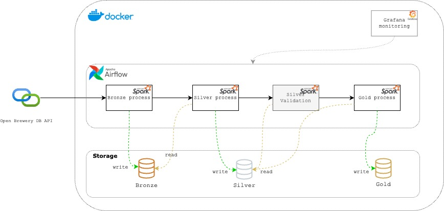

# BEES Data Engineering – Breweries Case

____
# Author
* **Patrick Martini**
* [Linkedin](https://www.linkedin.com/in/patrickmartinni/)
* trickmartini@gmail.com
____
# Objective
This data pipeline retrieves brewery data from the **Open Brewery DB API** and follows the `medallion architecture`, performing data ingestion and transformation through the Bronze, Silver and Gold layers.
The pipelin utilizes:
* `PySpark` for data processing
* `Airflow` for orchestration
* `Docker` environment configuration

The processed data is stored in `parquet` files.


# Project Structure
```
BEES_Breweries_Case/
│── dags/                    # Airflow DAGs
│   ├── spark_airflow.py     # DAG for the Breweries ETL process 
│── grafana/                 # Grafana files
│   ├──dashboards/           # Grafana dashboards scripts 
│── logs/                    # Logs generates by Airflow
│── output/                  # output files from ETL process
│── scripts/                 # Pyspark scripts for data processing
│   ├── bronze_process.py    # ETL script for bronze layer
│   ├── gold_process.py      # ETL script for gold layer
│   ├── silver_process.py    # ETL script for silver layer
│   │── validations/         # Directory for validation scripts
│── Dockerfile               # Custom Airflow image with PySpark
│── docker-compose.yaml      # Docker compose configuration
│── readme.md                # Project documentation
│── requirements.txt         # Python dependencies

```
# Requirements
Before running the pipeline, make sure Docker is installed. If not, follow oficial installment instructions bellow:
* [Install Docker](https://docs.docker.com/get-started/get-docker/)

# Setup & Installation
## 1. Clone Repository
``` 
git clone https://github.com/trickmartini/BEES_Breweries_Case.git

```
## 2. Build and Start the Containers
```
docker-compose up -d --build
```
this will: 
* Build Airflow image + PySpark dependencies.
* Start Airflow and Spark containers.

## 3. Access Airflow UI
1. Open your browser and navigate to: http://localhost:8080
2. using the following credentials:
* Username: `airflow`
* Password: `airflow`

## 4. Configure spark connection
1. In Airflow UI, go to:
> Admin -> Connections -> create connection (click the "+" button).
2. Fill in the following credentials:
```
   Connection id: spark-conn
   Connection Type: Spark
   Host: spark://{full spark-master container name, check it in Docker.}
   Port: 7077
   Deploy mode: client
   Spark binary: spark-submit
   ```
3. Click Save

## 5. Grafana
### Configure Aiflow connection on Grafana
1. In Grafana UI, go to:
> Connections > Data Sources > Add new data source
2. Search for PostgreSQL
3. Fill in the following credentials:
```
Host URL: {full postgres container name, check it in Docker.}:5432
Database name: airflow
username: airflow
password: ariflow
TLS/SSL Mode: disable
Version: 13
```
4. Click Save & test

### Create monitoring dashboard 
To import the monitoring dashboard, execute the following commands in the terminal:
```bash
cd grafana
./import_dashboard_grafana.sh
```
This will automatically configure the Grafana dashboard for monitoring the pipeline execution.
# Running Pipeline
## Triggering the pipeline via Airflow Web Interface
You can manually trigger the pipeline using the Airflow Web Interface.
### Steps:
1. Open Airflow UI and navigate to the `DAGs` section
2. Locate and open  `breweries_etl_process`
3. Click on `Trigger DAG` to start the process.

### Monitoring Executions & Logs
* To track execution progress, go to the `Graph` view. 
* Click on any step to see its detailed logs under the `Logs` section.
* Use Grafana dashboards to monitor the pipeline's execution metrics and system performance in real time. Check how to use it in the Monitoring and DAta Quality section.
# Pipeline Architecture
## Overall


This ETL process retrieves data from the Open Brewery DB API and process it through the Bronze, Silver and Gold layers.
Data available in Gold layer can be used for data visualization tools(e.g., Power BI, Tableau) or queried via SQL interface.
Additionally, Grafana dashboards are utilized for monitoring.

## Technology stak
This project utilizes PySpark for ETL processing due to its high performance, especially when handling large-scale data in a distributed and efficient manner. PySpark also provides scalability, allowing the process to adapt seamlessly to different workloads while ensuring flexibility and robustness.

For workflow orchestration, Apache Airflow was chosen as it is a comprehensive orchestration tool with strong integration capabilities across various technologies. Airflow provides advanced features such as task dependency management, execution monitoring, and dynamic pipeline creation, offering greater control and automation over ETL processes.

The combination of Airflow and PySpark ensures a scalable and reliable execution environment, enabling scheduling, tracking, and debugging of data workflows efficiently. Additionally, this approach facilitates integration with storage, visualization, and monitoring tools, delivering a complete and maintainable data pipeline solution.

## Bronze Process
This Process fetches data from the API, and write the answer in the Bronze layer in its raw format (JSON).

## Silver Process
This process reads data from Bronze layer, applies the transformations bellow, and writes the transformed data to the Silver layer.
1. cast the `latitude` column to `DoubleType()`, to facilitate this data consumption in visualization tools like Power Bi or Tableau.
2. cast the `longitude` column  to `DoubleType()`, for the same reason above.
3. Drop the `street` column, since it contains the same value as  `address_1`, given that the dataset also includes `address_2` and `address_3`, only `address_1` is retained for consistency.

# Gold Process
This process reads data from Silver layer, aggregates it, and writes the results to the Gold layer.
It generates the following table: 
* `breweries_by_location` --> aggregated by: `country, state, city, brewery_type`

This table can be consumed by data visualization tools (e.g., Power BI, Tableau). 

Since it is aggregated at different hierarchical levels, it supports `drill-down` and `drill-up` visualizations.


# Monitoring and Data Quality

## Monitoring
To enhance pipeline monitoring and observability, Grafana was integrated into the architecture. Grafana was chosen for its real-time visualization capabilities, allowing efficient tracking of ETL workflows and system performance. It provides a user-friendly interface with custom dashboards that display critical execution metrics, ensuring better control and decision-making regarding the pipeline’s health.

Dashboards Overview
Three key dashboards were created to monitor the Airflow pipelines:

1. DAG Execution History Dashboard
* Displays all DAG executions within a selected time period.
* Helps analyze execution patterns and identify potential bottlenecks.
2. Latest DAG Execution Status Dashboard
* Shows the latest execution status of each DAG in the system.
* Useful for quickly identifying failed or pending DAGs that need attention.
3. Execution Success & Failure Trends Dashboard
* Tracks the number of successful and failed DAG executions over time.
* Helps detect anomalies or trends that could indicate issues with data ingestion, transformations, or system performance.

### How to access Grafana
1. Open Grafana UI, go to: http://localhost:3000/
2. Log in using the following credentials:
   * user: `admin`
   * password: `admin`
3. Navigate to `Dashboards > Breweries Monitoring` to view real-time execution metrics.

## Data Quality

### Silver Layer
1. Ensure data type consistency by transforming fields to their expected types.
2. Search for inconsistent records, such as those with `null` values in critical fields (`id`, `country`, `state`, `city`, or `brewery_type`), as these fields are essential for this specific workflow.
3. Since this validation is part of the Airflow DAG execution process, any test failures result in a failed DAG execution. This ensures that incorrect or incomplete data is not delivered to subsequent layers, maintaining data integrity and reliability.


# Useful Commands
| Action                   | Command                   |
|--------------------------|---------------------------|
| Start Airflow & Spark    | docker-compose up --build | 
| Stop All Containers      | docker-compose down       |
| Restar Airflow           | docker-compose restart    |
| Check DAGs in Airflow UI | Open [Airflow UI](http://localhost:8080 )       |

